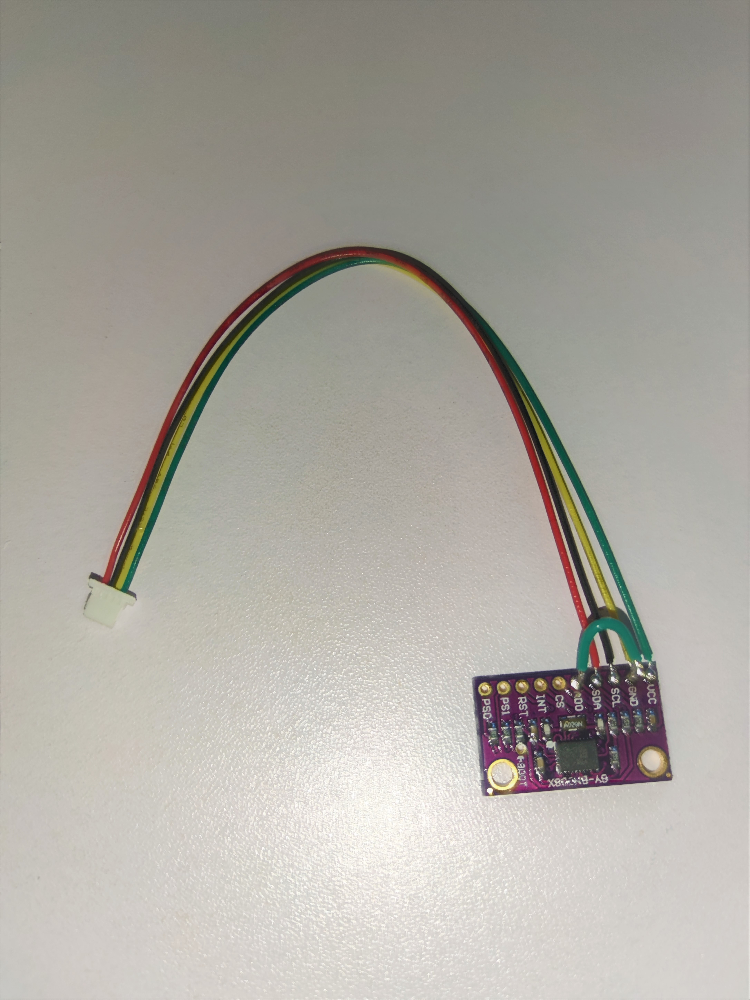
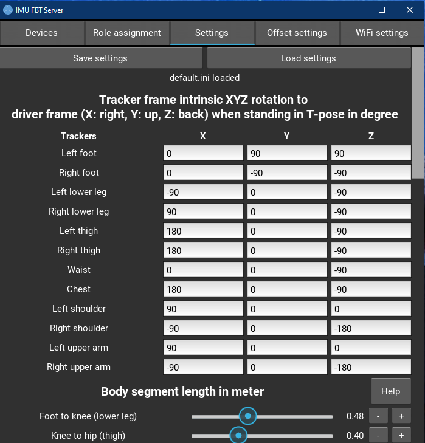
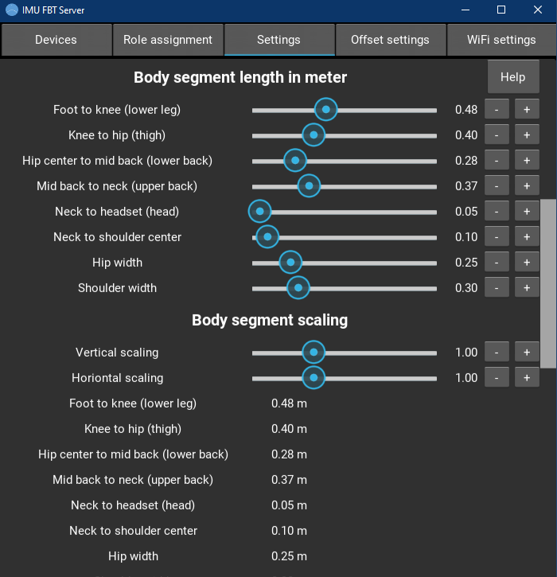
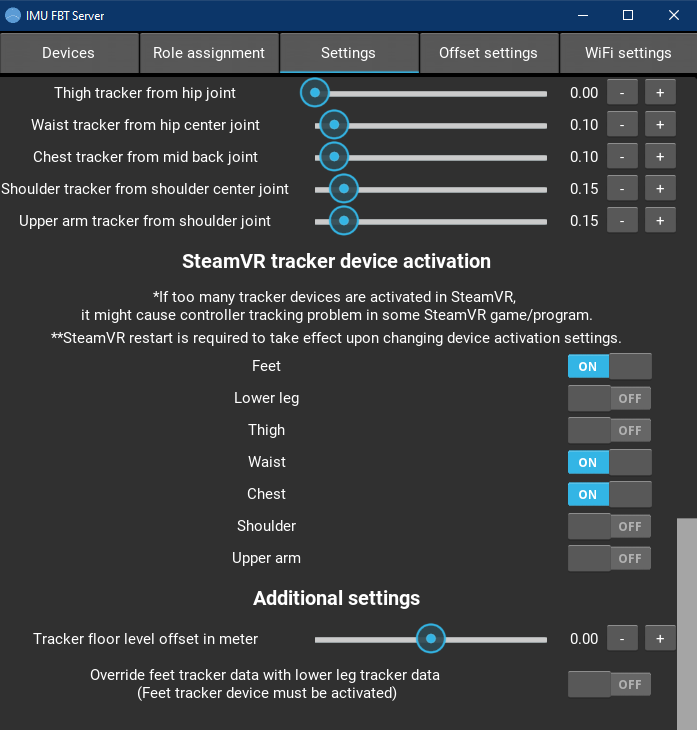
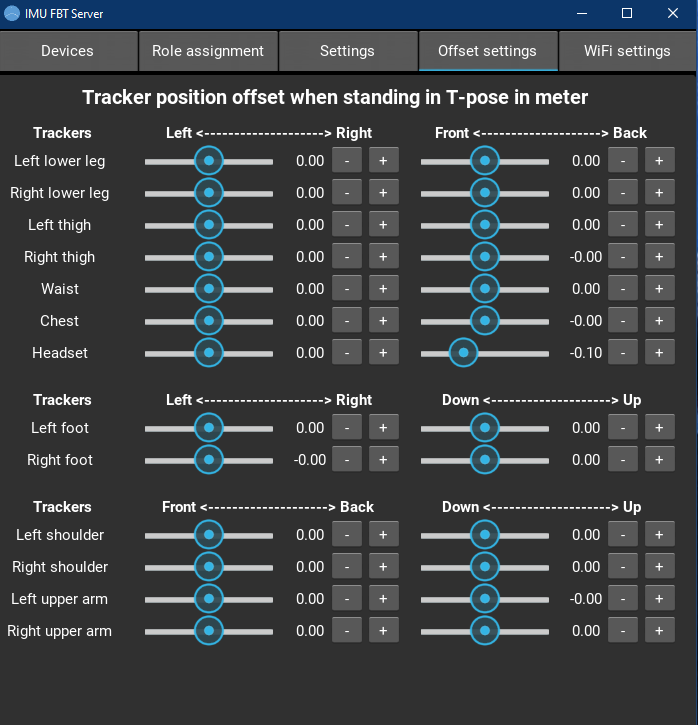
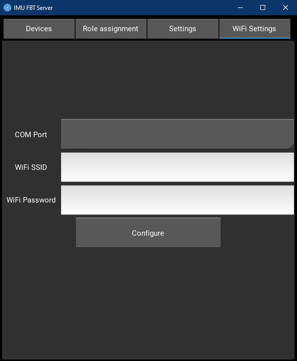

# IMU-VR-Full-Body-Tracker
 Inside-out full body tracker for Steam VR based on ESP32 with BNO080/085 IMU.  
 Support up to 2 BNO08X IMUs per ESP32 via I2C communication.  
 No base station is required, completely wireless using WiFi UDP.  
 Should be compatible with any VR headset that supports Steam VR.  
 

 
 
 

 
## Hardware Example
 **LILYGO® TTGO T7 V1.5 Mini32 ESP32-WROVER-B** with **GY-BNO08X**  
 

 
 
 

 

 
 
 
 

 

 

 
 

## Instruction
 1. Extract steamvr.driver.zip and copy imuFBT folder to (Steam directory)\steamapps\common\SteamVR\drivers.  
 2. Extract esp32.sketch.zip, edit the settings (pin settings, etc.) in esp32_settings.h file.  
 3. Upload the sketch to ESP32 microcontroller with Arduino IDE (SparkFun_BNO080_Arduino_Library Arduino library is required).  
 4. Extract desktop.server.zip and run imufbtserver.exe (might trigger antivirus false positive, known problem for unsigned PyInstaller exe files).  
 5. Set the tracker sensor frame to driver frame (X right, Y up, Z back) XYZ intrinsic rotation based on the mounting orientation, body segment length, tracker position and offset settings when standing in T-pose** in **Main settings** and **Offset settings** tab.  
 6. Activate required tracker devices to be output to SteamVR. In some SteamVR game/program, the hand controllers might lose tracking or not working if too many tracker devices are activated.  
 7. Set the tracker floor level offset (tracker min Y value) if necessary.  
 8. Enable override feet tracker data with lower leg tracker data if want to use lower leg tracker as foot role. Feet tracker device must still be activated.  
 9. Save the settings by pressing **Save settings** button or load an existing saved settings by pressing **Load settings** button in **Settings** tab. The last saved/loaded settings will be automatically loaded in the next instance.  
 

 
 
 
 
 
 

 
 10. Plug in USB cable to ESP32 and set the WiFi credential in **WiFi Settings** tab.  
 

 
 

 
 11. Once WiFi credential is configured, unplug the USB cable and power cycle the ESP32 to establish WiFi connection.  
 12. The trackers will be listed in **Device settings** tabs.  
 13. Set the IMU mode, WiFi TX power, WiFi power saving mode and role of the trackers in **Device settings** tab.  
 

 
 

 
 14. Click **Connect** slider, and the trackers with correct settings will be shown in **Devices** tab.  
 15. Save the settings in **Main settings** tab to save the device settings.  
 

 
 

 
 16. Mount the trackers according to the following diagram. For feet/leg tracking, chest tracker, waist tracker, thigh trackers and lower leg trackers are required. Feet trackers are optional. For elbow tracking, chest tracker, shoulder trackers and upper arm trackers are required.  
 

 
 
 

 
 17. Open SteamVR.  
 18. The trackers will be shown in SteamVR environment at weird position and orientation on startup.  
 19. Stand in T-pose**, then press **Calibrate** button in **Devices** tab to realign/calibrate the trackers.  
 

 
 

 
 20. Done!  
 

 
 
 

 
 **Stand straight look forward with feet pointing forward and hip-width apart in T-pose with palm facing down.
